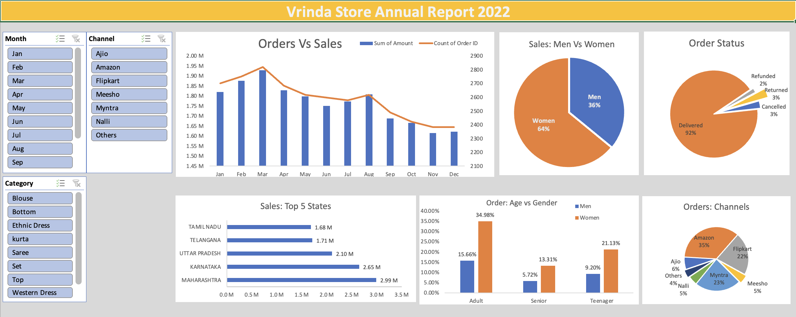
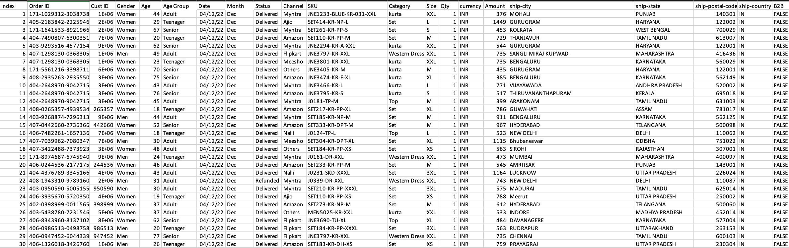

# 📊 Vrinda Store Annual Report 2022

This project showcases an interactive Excel dashboard built using **Power Pivot**, **Pivot Charts**, and **Slicers** to represent the annual performance of **Vrinda Store** in 2022.

The dashboard provides key insights into sales, orders, demographics, and channel performance using a fashion e-commerce dataset.

## 📁 Project Structure

```
📂 Vrinda-Store-Dashboard/
├── Dashboard Screenshot.png
├── Sample Dataset Screenshot.png
├── Vrinda Store Data Analysis.xlsx
├── README.md
```

---

## 🎯 Objective

To design a dynamic and visually compelling dashboard that helps stakeholders understand:

- Monthly trends of **Orders vs Sales**
- Customer **demographics** (age & gender distribution)
- **Top performing states**
- **Channel-wise order distribution**
- **Order fulfillment status**
- **Product category segmentation**

---

## 📈 Key Visuals

1. **Orders vs Sales Line & Bar Chart**  
   - Trend across months
   - Sales amount (bar) vs Order count (line)

2. **Pie Charts**  
   - Sales by **Gender**
   - **Order Status** (Delivered, Cancelled, Returned, Refunded)
   - Orders by **Sales Channels** (Amazon, Flipkart, Myntra, etc.)

3. **Bar Charts**  
   - Top 5 States by Sales
   - Age vs Gender Distribution of Customers

4. **Filters (Slicers)**  
   - Month, Channel, Product Category

---

## 📊 Sample Dataset Columns

The dataset contains the following fields:

- `Order ID`, `Cust ID`, `Gender`, `Age`, `Age Group`
- `Date`, `Month`, `Status`, `Channel`, `Category`, `SKU`
- `Qty`, `Amount`, `City`, `State`, `Postal Code`, `Country`
- `B2C/B2B Flag`

> 📌 Note: Data has been anonymized and cleaned for visualization purposes.

---

## ⚙️ Tools Used

- **Microsoft Excel**
  - Power Pivot
  - Pivot Tables & Charts
  - Slicers
- **Power BI (Optional extension)** – You can also convert this to a Power BI dashboard.

---

## 📌 Insights Gained

- **Women** contribute to **64% of sales**, with most being **Adult** age group.
- **Amazon** dominates as the primary sales channel (**35%** of total orders).
- **Maharashtra** is the top-performing state with ~3M in sales.
- **92%** of orders were successfully delivered.
- Peak orders and sales occurred in **March**.

---

## 📷 Dashboard Preview



## 📄 Sample Data Preview



---

## ✅ Future Improvements

- Integrate with **Power BI** for better scalability.
- Add **forecasting features** for sales prediction.
- Include **profit margin analysis** by category.

---

## 🙋‍♂️ Author

**Dipesh Yadav**  
From Gurugram, Haryana  
🔗 [LinkedIn](https://www.linkedin.com/in/dipesh-yadav-datascientist/)
📧 *dipeshyadav4444@gmail.com*
